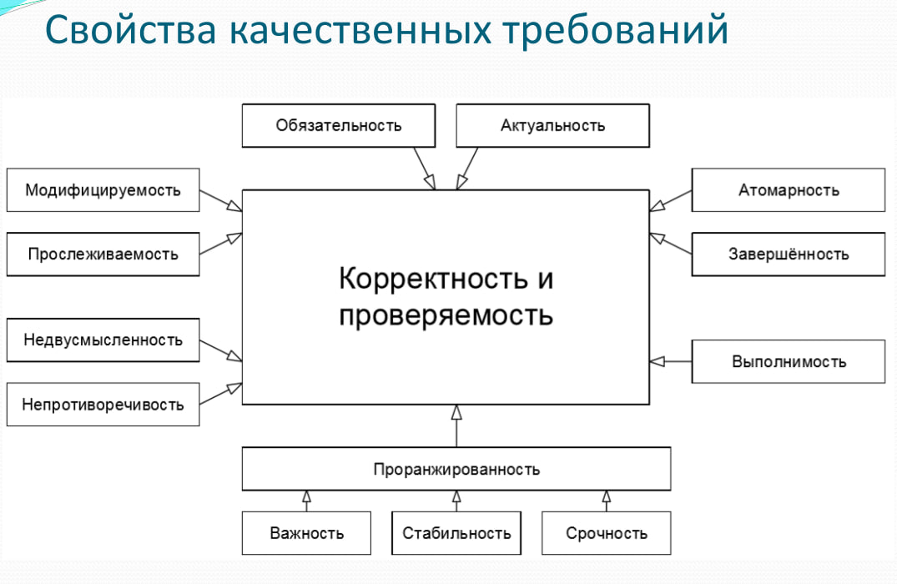

# БАЗА ПО ПИ

---

## 📘 1. Тестирование в жизненном цикле программного обеспечения

### 🧩 Общие понятия

**Жизненный цикл программного обеспечения (ЖЦ ПО)** — период от идеи создания ПО до снятия его с экспулатации. 

**Тестирование** — это процесс, направленный на обнаружение ошибок в программном продукте и оценку его качества.

Роль тестирования:

* Проверка соответствия продукта требованиям.
* Обеспечение надежности и безопасности.
* Минимизация рисков отказов в эксплуатации.
* Обеспечение доверия со стороны заказчика и пользователей.

---

### 🔁 Тестирование в различных моделях ЖЦ ПО

#### 📌 Водопадная модель (Каскадная модель, waterfall)

##### Этапы:

Общее планирование -> Пользовательские требования -> Системные требования -> Техническая архитектура -> Детализированный дизайн -> Разработка и отладка (начинает в явном виде проявляться тестирования) -> Интеграция и модульные тесты -> Инсталляционное тестирование -> Системное тестирование -> Приемочное тестирование -> Итоговая отчетность 

##### Особенности:

* Тестирование идет после завершения реализации.
* Цена ошибки значительно растет в конце. 
* Нельзя вернуться на предыдущий этап

---

#### 📌 V-модель (Verification and Validation)

Упрощённо можно сказать, что на каждой стадии «на спуске» нужно думать о том, что и как будет происходить на соответствующей стадии «наподъёме». Тестирование здесь появляется уже на самых ранних стадиях развития проекта, что позволяет минимизировать риски, а также обнаружить и устранить множество потенциальных проблем.

##### Характеристики:

* Расширение каскадной модели с акцентом на **верификацию** и **валидацию**.
* Каждому этапу разработки соответствует этап тестирования.

##### Роль тестирования:

* Включается с самого начала (тест-дизайн на основе требований).
* Тестирование планируется параллельно этапам разработки.

##### Соответствие этапов:

| Этап разработки | Соответствующий этап тестирования            |
| --------------- | -------------------------------------------- |
| Требования      | Приемочное тестирование (Acceptance testing) |
| Архитектура     | Системное тестирование                       |
| Дизайн          | Интеграционное тестирование                  |
| Кодирование     | Модульное тестирование                       |

---

#### 📌 Инкрементная и итеративная модель

Разбиение проекта на относительно небольшие промежутки (итерации), каждый из которых в общем случае может включать в себя все классические стадии, присущие водопадной и v-образной моделям. Итогом итерации является приращение (инкремент) функциональности продукта, выраженное в промежуточной сборке.

##### Характеристики:

* ПО разрабатывается по частям (инкрементам).
* Итерации позволяют регулярно вносить изменения и улучшения.

##### Роль тестирования:

* Тестирование проводится на каждом инкременте.
* Активное использование **юнит- и интеграционного тестирования**.

---

#### 📌 Спиральная модель

Повышенное внимание к рискам является преимуществом для разработки концептуальных проектов, в которых требования являются сложными и нестабильными (могут многократно меняться в ходе выполнения проекта).

##### Характеристики:

* Делает акцент на управление рисками.
* Каждый виток включает планирование, анализ рисков, разработку и тестирование.

##### Роль тестирования:

* Выполняется на каждом витке.
* Большое внимание отводится **валидации и верификации**.

---

#### 📌 Гибкая (гибкие методологии: Scrum, Kanban, Agile и др.)

Впервые был достигнут ощутимый результат в снижении бюрократической составляющей и максимальной адаптации процесса разработки программного обеспечения к мгновенным изменениям рынка и требований заказчика.

##### Характеристики:

* Короткие спринты, работа с изменяющимися требованиями.
* Разработка и тестирование идут параллельно.

##### Роль тестирования:

* Тестирование — **непрерывный процесс**.
* Активное использование **автоматизированного тестирования**, **юнит-тестов**, **интеграционного и приемочного тестирования**.
* Применяются **практики TDD (разработка через тестирование)**.

---

### 🔄 Сравнение моделей разработки ПО

| Модель                             | Преимущества                                                                                                                                            | Недостатки                                                                                                       | Особенности тестирования                                                                            |
| ---------------------------------- | ------------------------------------------------------------------------------------------------------------------------------------------------------- | ---------------------------------------------------------------------------------------------------------------- | --------------------------------------------------------------------------------------------------- |
| **Водопадная (каскадная)**         | - У каждой стадии есть чёткий проверяемый результат   - Команда выполняет один вид работы в каждый момент   - Хорошо подходит для небольших задач | - Полная неспособность адаптироваться к изменяющимся требованиям   - Очень поздняя проверка работоспособности | - **С середины проекта**   - Основное тестирование после реализации                              |
| **V-образная**                     | - Чёткий результат на каждой стадии   - Тестирование планируется с самого начала   - Подходит для проектов со стабильными требованиями            | - Недостаточная гибкость   - Отсутствие раннего прототипирования   - Сложность устранения ранних ошибок    | - **На переходах между стадиями**   - Каждой стадии соответствует тип тестирования               |
| **Итерационная / Инкрементальная** | - Раннее прототипирование   - Простое управление итерациями   - Декомпозиция на управляемые части                                                 | - Недостаточная гибкость внутри итераций   - Сложность устранения ранних ошибок                               | - В определённые моменты итераций   - Повторное тестирование после доработки                     |
| **Спиральная**                     | - Глубокий анализ рисков   - Подходит для крупных проектов   - Раннее прототипирование                                                            | - Высокие накладные расходы   - Сложна для небольших проектов   - Зависит от качества анализа рисков       | - На каждом витке   - Валидация, верификация, тестирование промежуточных прототипов              |
| **Гибкая (Agile)**                 | - Максимальное вовлечение заказчика   - Работа с требованиями   - Интеграция тестирования и разработки   - Минимум документации                | - Сложность масштабирования   - Трудности со стабильными процессами                                           | - В определённые моменты итераций и **в любой необходимый момент**   - Поддержка TDD, BDD, CI/CD |

---

Вот оформленный конспект по теме **«Критерии качества ПО»** в том же стиле и формате, что и предыдущий пункт:

---

## 📘 2. Критерии качества ПО

### 🧪 Определения и ключевые понятия

**Тестирование программного обеспечения** — процесс анализа программного средства и сопутствующей документации с целью выявления дефектов и повышения качества продукта.

#### 🔹 Качество программного обеспечения (Software Quality)

1. **Определение 1:** степень, в которой программное обеспечение обладает требуемой комбинацией свойств.
2. **Определение 2:** совокупность характеристик программного обеспечения, относящихся к его способности удовлетворять установленные и предполагаемые потребности.

#### 🔹 Обеспечение качества (Quality Assurance, QA)

Совокупность мероприятий, охватывающих все технологические этапы разработки, выпуска и эксплуатации ПО.
Цель — обеспечить требуемый уровень качества на всех стадиях жизненного цикла.

#### 🔹 Контроль качества (Quality Control, QC)

Совокупность действий, проводимых **над продуктом** в процессе разработки для:

* оценки готовности продукта к выпуску,
* проверки соответствия требованиям,
* анализа уровня качества продукта.

#### 🔹 Тестирование ПО (Software Testing)

Одна из техник контроля качества, включающая:

* **Test Management** — планирование работ по тестированию;
* **Test Design** — проектирование тестов;
* **Test Execution** — выполнение тестов;
* **Test Analysis** — анализ результатов тестирования.

#### 🔹 Верификация (Verification)

Оценка соответствия промежуточного результата **текущего этапа** требованиям, сформулированным **в начале этого этапа**.

> Проверяется: *делаем ли мы продукт правильно*?

#### 🔹 Валидация (Validation)

Оценка соответствия **готового ПО** ожиданиям пользователя и бизнес-требованиям.

> Проверяется: *делаем ли мы правильный продукт*?

---

### 📐 Основные характеристики качества ПО

| Характеристика             | Краткое описание                                                       |
| -------------------------- | ---------------------------------------------------------------------- |
| **Функциональность**       | Соответствие поведения системы требованиям и ожиданиям пользователя    |
| **Надежность**             | Способность функционировать без сбоев и восстанавливаться после ошибок |
| **Удобство использования** | Легкость изучения и взаимодействия с ПО                                |
| **Эффективность**          | Производительность при использовании ресурсов                          |
| **Удобство сопровождения** | Легкость анализа, модификации и тестирования                           |
| **Портативность**          | Легкость переноса между различными средами                             |

---

### 🧱 Расшифровка характеристик качества ПО

#### 🔹 Функциональность (Functionality)

* Способность выполнять требуемые функции.
* Соответствие требованиям и стандартам.
* Точность, безопасность и совместимость.

#### 🔹 Надёжность (Reliability)

* Надёжная работа в течение времени.
* Завершённость, отказоустойчивость.
* Способность восстанавливаться после сбоев.

#### 🔹 Удобство использования (Usability)

* Простота изучения и понимания интерфейса.
* Удобство работы пользователя.
* Визуальная и логическая понятность системы.

#### 🔹 Эффективность (Efficiency)

* Временная эффективность (быстродействие).
* Рациональное использование ресурсов (CPU, RAM и т. д.).

#### 🔹 Удобство сопровождения (Maintainability)

* Возможность легко анализировать код и поведение.
* Простота модификации и исправления дефектов.
* Адаптируемость к изменяющемуся окружению.

#### 🔹 Портативность (Portability)

* Легкость установки и настройки в новой среде.
* Замена компонентов без потери функциональности.
* Совместимость с различными платформами.

---

## 📘 3. Требования: уровни, виды. Сбор требований

### 📌 Определение

**Требование (requirement)** — описание того, какие функции и с соблюдением каких условий должно выполнять приложение в процессе решения полезной для пользователя задачи.

---

### 🧱 Уровни и типы требований

#### 🔹 Пользовательские требования (User Requirements)

* Описывают задачи, которые пользователь может выполнять с помощью системы.
* Включают сценарии взаимодействия и реакции системы.
* Используются для оценки объема работ, стоимости и сроков разработки.

#### 🔹 Бизнес-правила (Business Rules)

* Отражают особенности предметной области или специфики заказчика.
* Включают ограничения и регламент поведения, связанные с бизнес-процессами или организацией.

#### 🔹 Атрибуты качества (Quality Attributes)

* Расширяют нефункциональные требования.
* Включают производительность, масштабируемость, восстанавливаемость и другие критические для продукта показатели.

#### 🔹 Функциональные требования (Functional Requirements)

* Описывают поведение системы: вычисления, преобразования, обработку данных и др.
* Влияют на **дизайн** и логику реализации.

#### 🔹 Нефункциональные требования (Non-functional Requirements)

* Описывают свойства системы: удобство, безопасность, надежность, расширяемость и пр.
* Влияют на **архитектуру** и платформенные решения.

#### 🔹 Ограничения (Constraints)

* Технические, организационные или регуляторные факторы, ограничивающие реализацию продукта.
* Примеры: бюджет, совместимость, используемые технологии.

#### 🔹 Требования к интерфейсам (External Interface Requirements)

* Описывают взаимодействие с другими системами и операционной средой.
* Включают протоколы, API, форматы данных.

#### 🔹 Требования к данным (Data Requirements)

* Описывают структуру и формат данных, с которыми работает система.
* Часто включают описание базы данных, хранения и обработки информации.

---

### 📄 Спецификация требований

**Software Requirements Specification (SRS)** — структурированный документ, объединяющий все требования уровня продукта.

* Может быть очень объемным (сотни и тысячи страниц).
* Формирует основу для проектирования, тестирования и оценки готовности системы.

---

### 🎯 Свойства качественных требований

Хорошие требования должны быть:

* Полными
* Однозначными
* Проверяемыми
* Реалистичными
* Прослеживаемыми
* Согласованными

---

### 🛠️ Основные техники сбора и выявления требований

| Метод                        | Описание                                           |
| ---------------------------- | -------------------------------------------------- |
| **Интервью**                 | Общение с заказчиками и пользователями             |
| **Фокусные группы**          | Групповые обсуждения с заинтересованными сторонами |
| **Анкетирование**            | Массовый сбор мнений с помощью опросов             |
| **Семинары / брейншторм**    | Коллективная генерация идей и требований           |
| **Наблюдение**               | Изучение текущих процессов в действии              |
| **Прототипирование**         | Создание черновых макетов и моделей                |
| **Анализ документов**        | Изучение существующей документации                 |
| **Моделирование процессов**  | Использование диаграмм, BPMN, UML                  |
| **Самостоятельное описание** | Инициатива от аналитика на основе опыта            |

---
